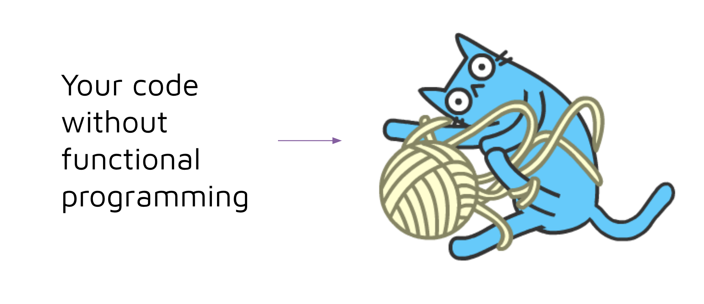
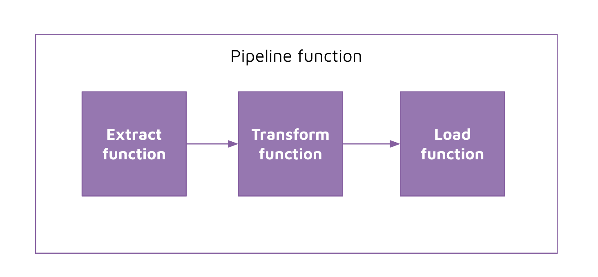

# Functional Programming 

## Concept 

Writing our ETL with random code blocks in a Jupyter Notebook is not a very maintainable structure. As our code grows in complexity over the years, it is going to get harder to maintain and update the code. Not to mention if other developers were to work on your code, it is going to be even harder for them to understand. 

That is why we need to use good code practices. We will explore `functional programming` now, and then later we will look at `object oriented programming`. 

Writing our code using functional programming uses the following principles: 
- D.R.Y (don't repeat yourself): if we have repeated sections of our code, we can store repeated code inside a function.
- The output of a function only relies on the input of the function: The function should not be influenced by what is outside of it. 
- Modularise the code: if the code can be better represented into distinct steps, we can store those steps inside a function.

## Implement 

We are going to implement functional programming on our ETL code by creating functions for: 

- Extract: all the extraction logic goes here
- Transform: all the transform logic goes here
- Load: all the load logic goes here
- Pipeline: the wrapper function that invokes the extract, transform, and load functions respectively 

We are also going to make use of Python files instead of Jupyter Notebooks. 

Jupyter Notebooks are a great tool to write Python code when we are looking to validate the outputs of our code in a quick, visual and interactive way. Jupyter Notebooks are however not a great tool when we are looking to productionise our Python code. 

Jupyter Notebooks lacks certain features that Python files has to offer. For example: 

- Ability to import notebook files as modules
- Ability to easily test jupyter notebooks using testing frameworks like pytest 

For those reasons, we are going to focus on using Python files wherever possible, and only look to bring in Jupyter Notebooks again in special cases. 

